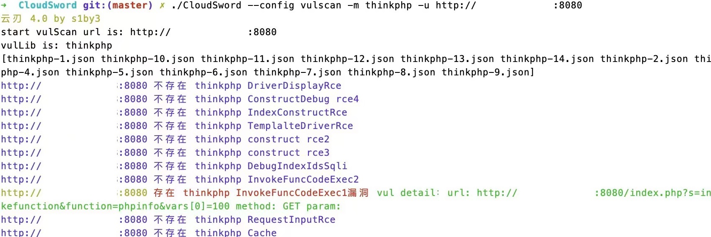

# 云刃

云刃CloudSword渗透测试框架，包含有资产搜集（端口扫描、路径爆破、指纹识别等）、漏洞扫描及利用的功能。
该项目采用go语言开发，高并发、内置指纹库（也可自定义指纹库），支持自定义漏洞扫描config。



```bash
端口扫描
./cloudsword --config portscan -h [主机]/24 -p [端口]
./cloudsword --config portscan -h 127.0.0.1/24 -p 1-65535
./cloudsword --config portscan -h 127.0.0.1
./cloudsword --config portscan -h 127.0.0.1/24 -p 80,443
./cloudsword --config portscan -h 127.0.0.1/24 -p all

指纹识别
./cloudsword --config fingerscan -u [url]

路径爆破
./cloudsword --config dirscan -u [url] -m asp,aspx(dir,php,jsp,mdb,php,php2,rar,tar,temp)

漏洞扫描
./CloudSword --config vulscan -m thinkphp(vul modules) -u http://ip:port 
```

